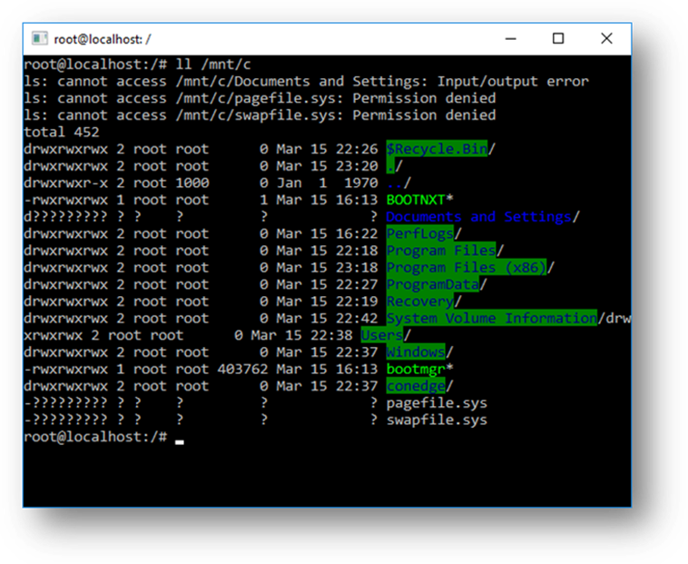

# 有关适用于 Linux 的 Windows 子系统的常见问题

## 普适性问题

### 适用于 Linux 的 Windows 子系统（WSL）是什么？

适用于 Linux 的 Windows 子系统是 Windows 操作系统的一项功能，它使您能够在 Windows 上直接运行 Linux 文件系统，以及 Linux 命令行工具和图形化应用程序，并与你传统的 Windows 桌面和应用程序一起使用。

如需更多详细信息，请参阅 [关于页面](./about.md)。

### 适用于 Linux 的 Windows 子系统适用于哪些人？

适用于 Linux 的 Windows 子系统主要是为开发人员设计的，特别是 Web 开发人员、在开源项目上工作的人员，或者部署到 Linux 服务器环境的人员。WSL 适用于喜欢使用 Bash、常见的 Linux 工具（`sed`、`awk` 等）和 Linux 优先框架（Ruby、Python 等），但同时也喜欢使用 Windows 生产力工具的任何人。

### 我可以在 WSL 做些什么？

WSL 使你能够在 Bash shell 中运行你选择的 Linux 发行版（Ubuntu、Debian、OpenSUSE、Kali、Alpine 等）。通过1使用 Bash，你可以运行 Linux 的命令行工具和应用程序。例如，键入 `lsb_release -a` 并按 Enter 键；你将看到当前运行的 Linux 发行版的详细信息：


你还可以从 Linux Bash shell 内访问本地计算机的文件系统——你会发现本地驱动器挂载在 `/mnt` 文件夹下。例如，你的 `C:` 驱动器挂载在 `/mnt/c` 下：



### 你可以描述一下包含 WSL 的典型开发工作流程吗？

WSL 以开发人员为目标受众，旨在用作内部开发循环的一部分。比方说，Sam 正在创建一个 CI/CD 管道（持续集成和持续交付），他希望先在本地机器（笔记本电脑）上进行测试，然后再部署到云上。Sam 可以启用 WSL（以及 WSL 2，以提高速度和性能），然后在本地（笔记本电脑上）使用真正的 Linux Ubuntu 实例，并使用他喜欢的任何 Bash 命令和工具。一旦开发管道在本地得到验证，Sam 就可以将该 CI/CD 管道推送到云端（如 Azure），方法是将其制作成一个 Docker 容器，并将该容器推送到一个云实例上，在该实例上运行的是一个可用于生产的 Ubuntu 虚拟机。

### Bash 是什么？

[Bash](https://en.wikipedia.org/wiki/Bash_%28Unix_shell%29) 是一种流行的基于文本的 shell 和命令语言。它是 Ubuntu 和其他 Linux 发行版中默认的 shell。用户在 shell 中键入命令以执行脚本和/或运行命令和工具，以完成许多任务。

### WSL 是如何工作的？ 


查看 Windows Command Line 博客上的这篇详细介绍了底层技术的文章： [深入了解 WSL 如何允许 Windows 访问 Linux 文件](https://devblogs.microsoft.com/commandline/a-deep-dive-into-how-wsl-allows-windows-to-access-linux-files/)。

### WSL 与 Linux 虚拟机相比有什么优势？

与完整的虚拟机相比，WSL 需要的资源（CPU、内存和存储空间）更少。WSL 还允许你在运行 Windows 命令行、桌面和存储应用程序的同时运行 Linux 命令行工具和应用程序，并从 Linux 中访问 Windows 文件。这样，您就可以根据需要在同一组文件上使用 Windows 应用程序和 Linux 命令行工具。

### 为什么我会，比方说，在 Linux 而不是在 Windows 上使用 Ruby？
 
一些跨平台工具在构建时假定其运行环境与 Linux 类似。例如，有些工具假定它们能够访问很长的文件路径或存在特定的文件/文件夹。这通常会在 Windows 上造成问题，因为 Windows 的行为通常与 Linux 不同。
          
许多语言（如 Ruby 和 Node.js）经常被移植到 Windows 上，并在 Windows 上运行良好。然而，并非所有的 Ruby Gem 或 node/NPM 库所有者都会将其库移植到 Windows 上，而且许多库都有特定于 Linux 的依赖关系。这往往会导致使用此类工具和库构建的系统在 Windows 上出现构建错误，有时还会出现运行时错误或不需要的行为。
          
这些问题导致许多人要求 Microsoft 改进 Windows 的命令行工具，也促使我们与 Canonical 合作，使原生的 Bash 和 Linux 命令行工具能够在 Windows 上运行。

### 这对 PowerShell 意味着什么？

在处理开放源码软件项目的过程中，从 PowerShell 转而使用 Bash 会有很多用处。对 Bash 的支持是对 Windows 命令行价值的补充和加强，使 PowerShell 和 PowerShell 社区能够利用其他流行技术。

更多信息请访问 PowerShell 团队博客：[Bash for Windows：为什么它很棒以及它对 PowerShell 的意义](https://devblogs.microsoft.com/powershell/bash-for-windows-why-its-awesome-and-what-it-means-for-powershell/)。

### WSL 支持哪些处理器？

WSL 支持 x64 和 Arm 处理器。

### 我可以怎样访问我的 C: 驱动器？

本地机器上的硬盘驱动器的挂载点会自动创建，从而提供对 Windows 文件系统的轻松访问。

**/mnt/\<驱动器号>/**

例如，你可以使用 `cd /mnt/c` 来访问 c:\。

### 我该如何设定 Git 凭据管理器？（我该如何在 WSL 中使用我的 Windows Git 权限？）

请参阅教程 [在 Windows 子系统上的 Linux 上开始使用 Git](./tutorials/wsl-git.md)，其中包含有关设置 Git 凭据管理器和将身份验证令牌存储在 Windows 凭据管理器中的部分。

### 怎样在 Linux 应用程序中使用 Windows 文件？

WSL 的众多优势之一是能够同时使用 Windows 和 Linux 应用程序或工具访问你的文件。

WSL 会将你的机器的固定驱动器挂载到 Linux 发行版的 `/mnt/<驱动器>` 文件夹下。例如，你的 `C:` 驱动器会挂载到 `/mnt/c/`。

通过挂载的驱动器，你可以使用 [Visual Studio](https://visualstudio.microsoft.com/vs/) 或 [VS Code](https://code.visualstudio.com/) 编辑 `C:\dev\myproj\` 中的代码，并通过 `/mnt/c/dev/myproj` 访问相同的文件来在 Linux 中构建/测试该代码。

了解更多信息，请参阅 [跨 Windows 和 Linux 文件系统工作](./filesystems.md) 文章。
          
      - question: |
         Are files in the Linux drive different from the mounted Windows drive?
        answer: |
          1. Files under the Linux root (i.e. `/`) are controlled by WSL which aligns with Linux behavior, including but not limited to:
             * Files which contain invalid Windows filename characters
             * Symlinks created for non-admin users
             * Changing file attributes through `chmod` and `chown`
             * File/folder case sensitivity
          
          2. Files in mounted drives are controlled by Windows and have the following behaviors:
             * Support case sensitivity
             * All permissions are set to best reflect the Windows permissions

      - question: |
         How do I uninstall a WSL Distribution?
        answer: |
          To remove a distribution from WSL and *delete all of the data associated with that Linux distribution*, run `wsl --unregister <distroName>` where `<distroName>` is the name of your Linux distro, which can be seen from the list in the `wsl -l` command. 

          Additionally, you can then uninstall the Linux distro app on your machine just like any other store application.

          To learn more about wsl commands, see the article, [Basic commands for WSL](./basic-commands.md).
          
      - question: |
         How do I run an OpenSSH server?
        answer: |
         OpenSSH ships with Windows as an optional feature. See the [Install OpenSSH](/windows-server/administration/openssh/openssh_install_firstuse) doc. Administrator privileges in Windows are required to run OpenSSH in WSL. To run an OpenSSH server, run your WSL distribution (i.e. Ubuntu) or Windows Terminal as an administrator. There are several resources out there covering SSH scenarios with WSL. Check out Scott Hanselman's blog articles: [How to SSH into a Windows 10 Machine from Linux OR Windows OR anywhere](https://www.hanselman.com/blog/how-to-ssh-into-a-windows-10-machine-from-linux-or-windows-or-anywhere), [How to SSH into WSL2 on Windows 10 from an external machine](https://www.hanselman.com/blog/how-to-ssh-into-wsl2-on-windows-10-from-an-external-machine), [THE EASY WAY how to SSH into Bash and WSL2 on Windows 10 from an external machine](https://www.hanselman.com/blog/the-easy-way-how-to-ssh-into-bash-and-wsl2-on-windows-10-from-an-external-machine), and [How to use Windows 10's built-in OpenSSH to automatically SSH into a remote Linux machine](https://www.hanselman.com/blog/how-to-use-windows-10s-builtin-openssh-to-automatically-ssh-into-a-remote-linux-machine). 

      - question: |
         How do I change the display language of WSL?
        answer: |
          WSL install will try to automatically change the Ubuntu locale to match the locale of your Windows install. If you do not want this behavior you can run this command to change the Ubuntu locale after install completes. You will have to relaunch your WSL distribution for this change to take effect.
          
          The below example changes the locale to en-US:
          
          ```bash
          sudo update-locale LANG=en_US.UTF8
          ```
          
      - question: |
         Why do I not have internet access from WSL?
        answer: |
          Some users have reported issues with specific firewall applications blocking internet access in WSL. The firewalls reported are:
          
          1. Kaspersky
          2. AVG
          3. Avast
          4. Symantec Endpoint Protection
          5. F-Secure
          
          In some cases turning off the firewall allows for access. In some cases simply having the firewall installed looks to block access.
          
      - question: |
         How do I access a port from WSL in Windows?
        answer: |
          WSL shares the IP address of Windows, as it is running on Windows. As such you can access any ports on localhost e.g. if you had web content on port 1234 you could https://localhost:1234 into your Windows browser.
          For more information, see [Accessing network applications](./networking.md).
          
      - question: |
         How can I back up my WSL distributions?
        answer: |
          The best way to backup or move your distributions is via the [export](./basic-commands.md#export-a-distribution)/[import](./basic-commands.md#import-a-distribution) commands available in Windows Version 1809 and later. You can export your entire distribution to a tarball using the `wsl --export` command. You can then import this distribution back into WSL using the `wsl --import` command, which can name a new drive location for the import, allowing you to backup and save states of (or move) your WSL distributions. To learn more about moving your WSL distributions, see [How can I transfer my WSL files from one machine to another?](#how-can-i-transfer-my-wsl-files-from-one-machine-to-another-). 
          
          Traditional backup services that backup files in your AppData folders (like Windows Backup) will not corrupt your Linux files.

      - question: |
         Can I use WSL for production scenarios? 
        answer: |
          Yes, however WSL has been designed and built to use with inner loop development workflows. There are design features in WSL that make it great for this purpose but may make it challenging for production-related scenarios compared to other products. Our goal is to make clear how WSL differs from a regular VM environment, so you can make the decision on whether it fits your business needs.

          The main differences between WSL and a traditional production environment are:

          * WSL has a lightweight utility VM that starts, stops and manages resources automatically.
          * If you have no open file handles to Windows processes, the WSL VM will automatically be shut down. This means if you are using it as a web server, SSH into it to run your server and then exit, the VM could shut down because it is detecting that users are finished using it and will clean up its resources.
          * WSL users have full access to their Linux instances. The lifetime of the VM, the registered WSL distributions, etc., are all accessible by the user and can be modified by the user.
          * WSL automatically gives file access to Windows files.
          * Windows paths are appended to your path by default, which could cause unexpected behavior for certain Linux applications compared to a traditional Linux environment.
          * WSL can run Windows executables from Linux, which could also lead to a different environment than a traditional Linux VM.
          * The Linux kernel used by WSL is updated automatically.
          * GPU access in WSL happens through a `/dev/dxg` device, which routes GPU calls out to the Windows GPU. This setup is different than a traditional Linux set up.
          * There are other smaller differences compared to bare metal Linux and more differences are expected to arise in the future as the inner loop development workflow is prioritized.
      
      - question: |
         How can I transfer my WSL files from one machine to another?
        answer: |
         There are a few ways you can accomplish this task: 
          
          * The easiest way is to use the `wsl --export --vhd` command to export your WSL distribution to a VHD file. You can then copy this file to another machine, and import it using `wsl --import --vhd`. See the [import](./basic-commands.md#import-a-distribution) and [export](./basic-commands.md#export-a-distribution) commands in [the WSL basic commands](./basic-commands.md) doc for more information.
          * The implementation above requires a lot of disk space. If you don't have a lot of disk space you can use Linux techniques to move your files over:
             * Use `tar -czf <tarballName> <directory>` to create a tarball of your files. You can then copy these specific files over to your new machine and run `tar -xzf <tarballName>` to extract them.
             * You can also export a list of installed packages via `apt` with a command like so: `dpkg --get-selections | grep -v deinstall | awk '{print $1}' > package_list.txt` and then reinstall those same packages on another machine with a command like `sudo apt install -y $(cat package_list.txt)` after transferring the file over.

      - question: |
         How can I move my WSL distribution to a different drive or location?
        answer: |
         You can do this using PowerShell. Below are the necessary commands and explanations for each step. Please open a PowerShell window and adjust the values in between the `<` tags to fit your specific use case:

         ```powershell
         # Create a folder where you would like to store your distro
         New-Item -ItemType Directory -Path <Install location, e.g: D:\WSLDistros\Ubuntu>

         # Export your distro to that folder as a VHD
         wsl --export --vhd <Distroname, e.g: Ubuntu> <Install Location with filename, e.g: D:\WSLDistros\Ubuntu\ext4.vhdx> 

         # Unregister your old distro
         # Please note this will erase your existing distro's file contents, please ensure the backup file you created in the 2nd step is present at the location and that the export operation completed successfully.
         # Please exercise caution when using this command, as it is destructive and could cause data loss.
         wsl --unregister <Distroname>

         # Import your VHD backup
         
         wsl --import-in-place <Distroname> <Install Location with filename>

         # Set your default user account
         
         You can set up your default user account by [setting a wsl.conf value of user.default=<name>](/windows/wsl/wsl-config#user-settings)


  - name: WSL 2
    questions:
      - question: |
          Is WSL 2 available on Windows 10 Home and Windows 11 Home?
        answer: |
          Yes. WSL 2 is available on all Desktop SKUs where WSL is available, including Windows 10 Home and Windows 11 Home.
          
          Specifically, WSL2 requires two features to be enabled: 
          1. "Virtual Machine Platform" (a subset of Hyper-V)
          2. "Windows Subsystem for Linux"
          
      - question: |
          Does WSL 2 use Hyper-V?
        answer: |
          The newest version of WSL uses a *subset* of Hyper-V architecture to enable its virtualization. This subset is provided as an optional component named "Virtual Machine Platform," available on all Desktop SKUs. 
                  
      - question: |
          What will happen to WSL 1? Will it be abandoned?
        answer: |
          We currently have no plans to deprecate WSL 1. You can run WSL 1 and WSL 2 distros side by side, and can upgrade and downgrade any distro at any time. Adding WSL 2 as a new architecture presents a better platform for the WSL team to deliver features that make WSL an amazing way to run a Linux environment in Windows.

      - question: |
          Will I be able to run WSL 2 and other 3rd party virtualization tools such as VMware, or VirtualBox?
        answer: |
          Some 3rd party applications cannot work when Hyper-V is in use, which means they will not be able to run when WSL 2 is enabled, such as VMware and VirtualBox. However, recently both VirtualBox and VMware have released versions that support Hyper-V and WSL2. Learn more about [VirtualBox's changes here](https://www.virtualbox.org/wiki/Changelog-6.0) and [VMware's changes here](https://blogs.vmware.com/workstation/2020/01/vmware-workstation-tech-preview-20h1.html). For troubleshooting issues, take a look at the [VirtualBox issue discussions in the WSL repo on GitHub](https://github.com/MicrosoftDocs/WSL/issues?q=is%3Aissue+virtualbox+sort%3Acomments-desc). StackOverflow also offers a helpful tip: [How to get VirtualBox 6.0 and WSL working at the same time](https://stackoverflow.com/questions/58031941/how-to-get-virtualbox-6-0-and-wsl-working-at-the-same-time).
          
          We are consistently working on solutions to support third-party integration of Hyper-V. For example, we expose a set of APIs called [Hypervisor Platform](/virtualization/api/) that third-party virtualization providers can use to make their software compatible with Hyper-V. This lets applications use the Hyper-V architecture for their emulation such as [the Google Android Emulator](https://devblogs.microsoft.com/visualstudio/hyper-v-android-emulator-support/), and VirtualBox 6 and above which are both now compatible with Hyper-V.

          See the WSL issues repo for more background and discussion on [WSL 2 issues with VirtualBox 6.1](https://github.com/MicrosoftDocs/WSL/issues/798).

          *If you're looking for a Windows virtual machine, VMWare, Hyper-V, VirtualBox, and Parallels VM downloads are [available on the Windows Dev Center](https://developer.microsoft.com/windows/downloads/virtual-machines/).
          
      - question: |
          Can I access the GPU in WSL 2? Are there plans to increase hardware support?
        answer: |
          We have released support for accessing the GPU inside of WSL 2 distributions! This means you can now use WSL for machine learning, artificial intelligence, and data science scenarios more easily when big data sets are involved. Check out the [get started with GPU support](./tutorials/gpu-compute.md) tutorial. As of right now WSL 2 does not include serial support, or USB device support. We are investigating the best way to add these features. However, USB support is now available through the USBIPD-WIN project. See [Connect USB devices](./connect-usb.md) for steps to set up USB device support.
          
      - question: |
          Can WSL 2 use networking applications?
        answer: |
          Yes, in general networking applications will work better and be faster with WSL 2 since it offers full system call compatibility. However, the WSL 2 architecture uses virtualized networking components, which means that WSL 2 will behave similarly to a virtual machine -- WSL 2 distributions will have a different IP address than the host machine (Windows OS). For more information, see [Accessing network applications with WSL](./networking.md). 
          
      - question: |
          Can I run WSL 2 in a virtual machine?
        answer: |
          Yes! You need to make sure that the virtual machine has nested virtualization enabled. This can be enabled in your parent Hyper-V host by running the following command in a PowerShell window with Administrator privileges:
          
          `Set-VMProcessor -VMName <VMName> -ExposeVirtualizationExtensions $true`
          
          Make sure to replace '&lt;VMName&gt;' with the name of your virtual machine.
          
      - question: |
          Can I use wsl.conf in WSL 2?
        answer: |
          WSL 2 supports the same wsl.conf file that WSL 1 uses. This means that any configuration options that you had set in a WSL 1 distro, such as automounting Windows drives, enabling or disabling interop, changing the directory where Windows drives will be mounted, etc. will all work inside of WSL 2. You can learn more about the configuration options in WSL in the [Distribution Management](/windows/wsl/wsl-config) page. Learn more about support for mounting drives, disks, devices, or virtual hard disks (VHDs) in the [Mount a Linux disk in WSL 2](./wsl2-mount-disk.md) article.
          
           [1]: https://www.virtualbox.org/wiki/Changelog-6.0
           [2]: https://learn.microsoft.com/virtualization/api/
           [3]: https://devblogs.microsoft.com/visualstudio/hyper-v-android-emulator-support/
           [4]: https://blogs.vmware.com/workstation/2020/01/vmware-workstation-tech-preview-20h1.html
  
      - question: |
         Where can I provide feedback?
        answer: |
          The [WSL product repo issues](https://github.com/Microsoft/wsl/issues) enables you to:
            - **Search existing issues** to see if there are any associated with a problem that you are having. Note that in the search bar, you can remove "is:open" to include issues that have already been resolved in your search. Please consider commenting or giving a thumbs up to any open issues that you would like to express your interest in moving forward as a priority.
            - **File a new issue**. If you have found a problem with WSL and there does not appear to be an existing issue, you can select the green *New issue* button and then choose *WSL - Bug Report*. You will need to include a title for the issue, your Windows build number (run `cmd.exe /c ver` to see your current build #), whether you're running WSL 1 or 2, your current Linux Kernel version # (run `wsl.exe --status` or `cat /proc/version`), the version # of your distribution (run `lsb_release -r`), any other software versions involved, the repro steps, expected behavior, actual behavior, and diagnostic logs if available and appropriate. For more info, see [contributing to WSL](https://github.com/microsoft/WSL/blob/master/CONTRIBUTING.md).
            - **File a feature request** by selecting the green *New issue* button and then select *Feature request*. You will need to address a few questions describing your request.

            You can also:

            - **File a documentation issue** using the [WSL docs repo](https://github.com/MicrosoftDocs/wsl/issues). To contribute to the WSL docs, see the [Microsoft Docs contributor guide](/contribute).
            - **File a Windows Terminal** issue using the the [Windows Terminal product repo](https://github.com/microsoft/terminal/issues) if your problem is related more to the Windows Terminal, Windows Console, or the command-line UI.
          
            If you'd like to stay up to date with the latest WSL news you can do so with:
          
            - Our [command-line team blog](https://devblogs.microsoft.com/commandline/)
            - Twitter. Please follow [@craigaloewen](https://twitter.com/craigaloewen) on Twitter to learn of news, updates, etc.
      
      - question: |
          How to resolve `Error: 0x800704ec This program is blocked by group policy. For more information, contact your system administrator.`?
        answer: |
          This error is caused by a group policy blocking WSL. To resolve, first run the command `wsl --update` to update to the latest Store version. If that doesn't resolve the issue, contact your administrator. Learn more about the difference between the inbox WSL and Store version of WSL: [WSL in the Microsoft Store](/windows/wsl/compare-versions#wsl-in-the-microsoft-store).

