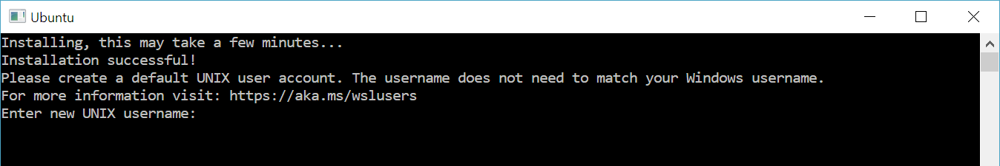

# 设置适用于 Linux 的 Windows 子系统的开发环境

这是设置适用于 Linux 的 Windows 子系统（Windows Subsystem for Linux，以下简称 WSL）开发环境的一个简单示例，你将了解到如何安装使用 Ubuntu 的默认 Bash shell，也可以学习如何设置并安装其他 Linux 发行版，使用基本 WSL 命令，设置 Visual Studio Code 或 Visual Studio、Git、Windows 凭据管理器，运行 MongoDB、Postgres、MySQL 等数据库，设置 GPU 加速，运行 GUI 应用程序等。

## 开始使用

适用于 Linux 的 Windows 子系统（Windows Subsystem for Linux）是由 Windows 操作系统自带的，但您必须先启用这项功能并安装 Linux 发行版，才能开始使用它。

若您想要使用简化的 `--install` 命令，您必须运行最新版本的 Windows 11（内部版本 20262 及以上）。若要检查版本和内部版本号，请选择 **Windows 徽标键 + R**，键入 **winver**，然后选择 **确定**。然后您可以使用 [设置- Windows 更新](ms-settings：windowsupdate) 或 [Windows 安装助手](https://www.microsoft.com/software-download/) 进行更新。

如果您想安装 Ubuntu 以外的 Linux 发行版，或者希望自定义安装，请参阅 [WSL 安装页面](../install.md) 了解更多详情。

打开 PowerShell (或 Windows 命令提示符) 并输入：

```powershell
wsl --install
```

--install 命令将执行以下操作：

- 启用可选的 适用于 Linux 的 Windows 子系统 和 虚拟机平台 组件
- 下载并安装最新的 Linux 内核
- 将 WSL 2 设置为默认版本
- 下载并安装 Ubuntu Linux 发行版（可能需要重新启动）

在此安装过程中，您需要重新启动计算机。


如果您遇到了一些问题，请查阅 [适用于 Linux 的 Windows 子系统疑难解答](../troubleshooting.md) 。

## 设置您的 Linux 用户名和密码

在 WSL 上安装完 Linux 发行版后，请在“开始”菜单打开它（默认为 Ubuntu），系统将要求您为此 Linux 发行版创建 **用户名** 和 **密码**。

- 此 **用户名** 和 **密码** 仅限于您安装的这一个 Linux 发行版，与您的 Windows 用户名无关。

- 请注意，在输入 **密码** 时，屏幕上不会显示任何内容。如果您没有看到输入的密码，这是完全正常的。

- 设置 **用户名** 和 **密码** 后，该账户将成为默认用户，并在启动此 Linhx 发行版时自动登录。

- 此帐户将被视为 Linux 系统管理员，能够运行 `sudo` （Super User Do） 管理命令。

- 在 WSL 上运行的每个 Linux 发行版都有自己的 Linux 帐户和密码。 当您每次安装新发行版本、重新安装或重置时，都必须重新配置 Linux 用户帐户。

> [!NOTE]
> 随 WSL 一起安装的 Linux 发行版是按用户安装的，不能与其他 Windows 用户帐户共享。遇到用户名错误？[StackExchange： Linux 上用户的名称要求有哪些？](https://serverfault.com/questions/73084/what-characters-should-i-use-or-not-use-in-usernames-on-linux)




要更改或重置密码，请打开 Linux 发行版并输入命令：“passwd”。系统将要求您输入旧密码，然后请您输入新密码，并二次确认您的新密码。

倘若您忘记了 Linux 发行版的密码，请尝试以下步骤：

1. 打开 PowerShell，然后使用命令 `wsl -u root` 进入默认 WSL 发行版的根目录；

   > 如果您需要在非默认发行版上更新忘记的密码，请使用命令：`wsl -d Debian -u root`，将 `Debian` 替换为目标发行版的名称。

2. 您可以使用以下命令更新您的密码：`passwd <username>`，其中`<username>` 是您忘记密码的帐户的用户名；

3. 系统将提示您输入新的密码，然后确认该密码。当告知您密码已成功更新后，请使用 `exit` 命令退出 PowerShell 中的 WSL。
   
## Update and upgrade packages

We recommend that you regularly update and upgrade your packages using the preferred package manager for the distribution. For Ubuntu or Debian, use the command:

```bash
sudo apt update && sudo apt upgrade
```

Windows does not automatically update or upgrade your Linux distribution(s). This is a task that most Linux users prefer to control themselves.

## Add additional distributions

To add additional Linux distributions, you can install via the [Microsoft Store](https://aka.ms/wslstore), via the [--import command](../use-custom-distro.md), or by [sideloading your own custom distribution](../build-custom-distro.md). You may also want to [set up custom WSL images for distribution across your enterprise company](../enterprise.md).

## Set up Windows Terminal

Windows Terminal can run any application with a command line interface. Its main features include multiple tabs, panes, Unicode and UTF-8 character support, a GPU accelerated text rendering engine, and the ability to create your own themes and customize text, colors, backgrounds, and shortcuts.

Whenever a new WSL Linux distribution is installed, a new instance will be created for it inside the Windows Terminal that can be customized to your preferences.

We recommend using WSL with Windows Terminal, especially if you plan to work with multiple command lines. See the Windows Terminal docs for help with setting it up and customizing your preferences, including:

- [Install Windows Terminal or Windows Terminal (Preview)](/windows/terminal/get-started) from the Microsoft Store
- [Use the Command Palette](/windows/terminal/get-started#invoke-the-command-palette)
- Set up [custom actions](/windows/terminal/#custom-actions) like keyboard shortcuts to make the terminal feel natural to your preferences
- Set up the [default startup profile](/windows/terminal/customize-settings/startup)
- Customize the appearance: [theme](/windows/terminal/customize-settings/appearance#theme), [color schemes](/windows/terminal/customize-settings/color-schemes), [name and starting directory](/windows/terminal/customize-settings/profile-general), [background image](/windows/terminal/customize-settings/profile-appearance#background-image), etc.
- Learn how to use [command line arguments](/windows/terminal/command-line-arguments?tabs=windows) like opening a terminal with multiple command lines split into window panes or tabs
- Learn about the [search feature](/windows/terminal/search)
- Find [tips and tricks](/windows/terminal/tips-and-tricks), like how to rename or color a tab, use mouse interactions, or enable "Quake mode"
- Find tutorials on how to set up [a customized command prompt](/windows/terminal/tutorials/custom-prompt-setup), [SSH profiles](/windows/terminal/tutorials/ssh), or [tab titles](/windows/terminal/tutorials/tab-title)
- Find a [custom terminal gallery](/windows/terminal/custom-terminal-gallery/custom-schemes) and a [troubleshooting guide](/windows/terminal/troubleshooting)


## File storage

- To open your WSL project in Windows File Explorer, enter: `explorer.exe .` <br /> *Be sure to add the period at the end of the command to open the current directory.*

- [Store your project files on the same operating system as the tools you plan to use](../filesystems.md#file-storage-and-performance-across-file-systems). <br />For the fastest performance speed, store your files in the WSL file system if you are working on them with Linux tools in a Linux command line (Ubuntu, OpenSUSE, etc). If you're working in a Windows command line (PowerShell, Command Prompt) with Windows tools, store your files in the Windows file system. Files can be accessed across the operating systems, but it may significantly slow down performance.

For example, when storing your WSL project files:

- Use the Linux file system root directory: `\\wsl$\<DistroName>\home\<UserName>\Project`
- Not the Windows file system root directory: `C:\Users\<UserName>\Project` or `/mnt/c/Users/<UserName>/Project$`


## Set up your favorite code editor

We recommend using Visual Studio Code or Visual Studio, as they directly support remote development and debugging with WSL. Visual Studio Code allows you to use WSL as a full-featured development environment. Visual Studio offers native WSL support for C++ cross-platform development. 

### Use Visual Studio Code

Follow this step-by-step guide to [Get started using Visual Studio Code with WSL](../tutorials/wsl-vscode.md), which includes installing the [Remote Development extension pack](https://marketplace.visualstudio.com/items?itemName=ms-vscode-remote.vscode-remote-extensionpack). This extension enables you to run WSL, SSH, or a development container for editing and debugging with the full set of Visual Studio Code features. Quickly swap between different, separate development environments and make updates without worrying about impacting your local machine.

Once VS Code is installed and set up, you can open your WSL project with a VS Code remote server by entering: `code .`

*Be sure to add the period at the end of the command to open the current directory.*


### Use Visual Studio

Follow this step-by-step guide to [Get started using Visual Studio with WSL for C++ cross-platform development](/cpp/build/walkthrough-build-debug-wsl2). Visual Studio 2022 enables you to build and debug CMake projects on Windows, WSL distributions, and SSH connections from the same instance of Visual Studio. 


## Set up version management with Git

Follow this step-by-step guide to [Get started using Git on WSL](../tutorials/wsl-git.md) and connect your project to the Git version control system, along with using the credential manager for authentication, using Git Ignore files, understanding Git line endings, and using the Git commands built-in to VS Code.


## Set up remote development containers with Docker

Follow this step-by-step guide to [Get started with Docker remote containers on WSL 2](../tutorials/wsl-containers.md) and connect your project to a remote development container with Docker Desktop for Windows.


## Set up a database

Follow this step-by-step guide to [Get started with databases on WSL](../tutorials/wsl-database.md) and connect your project to a database in the WSL environment. Get started with MySQL, PostgreSQL, MongoDB, Redis, Microsoft SQL Server, or SQLite.


## Set up GPU acceleration for faster performance
<!-- We should probably update this to be not just for "machine learning training", yes? -->
Follow this step-by-step guide to set up [GPU accelerated machine learning training in WSL](../tutorials/gpu-compute.md) and leverage your computer's GPU (graphics processing unit) to accelerate performance heavy workloads.


## Basic WSL commands

The Linux distributions that you install via WSL are best managed using PowerShell or Windows Command Prompt (CMD). See the [WSL command reference guide](../basic-commands.md) for a list of basic commands to be familiar with when using WSL.

In addition, many commands are interoperable between Windows and Linux. Here are a couple of examples:

- [Run Linux tools from a Windows command line](../filesystems.md#run-linux-tools-from-a-windows-command-line): Open PowerShell and display the directory contents of `C:\temp>` using the Linux `ls -la` command by entering: `wsl ls -la`

- [Mix Linux and Windows commands](../filesystems.md#mixing-linux-and-windows-commands): In this example, the Linux command `ls -la` is used to list files in the directory, then the PowerShell command `findstr` is used to filter the results for words containing "git": `wsl ls -la | findstr "git"`. This could also be done mixing the Windows `dir` command with the Linux `grep` command: `dir | wsl grep git`.

- [Run a Windows tool directly from the WSL command line](../filesystems.md#run-windows-tools-from-linux): `<tool-name>.exe`
    For example, to open your .bashrc file (the shell script that runs whenever your Linux command line is started), enter: `notepad.exe .bashrc`

- [Run the Windows ipconfig.exe tool with the Linux Grep tool](../filesystems.md#run-windows-tools-from-linux): From Bash enter the command `ipconfig.exe | grep IPv4 | cut -d: -f2` or from PowerShell enter `ipconfig.exe | wsl grep IPv4 | wsl cut -d: -f2`
    This example demonstrates the ipconfig tool on the Windows file system being used to display the current TCP/IP network configuration values and then being filtered to only the IPv4 result with grep, a Linux tool.

## Mount an external drive or USB

Follow this step-by-step guide to [Get started mounting a Linux disk in WSL 2](../wsl2-mount-disk.md).


## Run Linux GUI apps

Follow this tutorial to learn how to set up and [run Linux GUI apps on WSL](../tutorials/gui-apps.md).

## Additional resources

- [Set up your development environment on Windows](/windows/dev-environment/): Learn more about setting up your development environment for your preferred language or framework, such as React, Python, NodeJS, Vue, etc.
- [Troubleshooting](../troubleshooting.md): Find common issues, where to report bugs, where to request new features, and how to contribute to the docs.
- [FAQs](../faq.yml): Find a list of frequently asked questions.
- [Release Notes](../release-notes.md): Review the WSL Release Notes for a history of past build updates. You can also find the [release notes for the WSL Linux Kernel](../kernel-release-notes.md).
