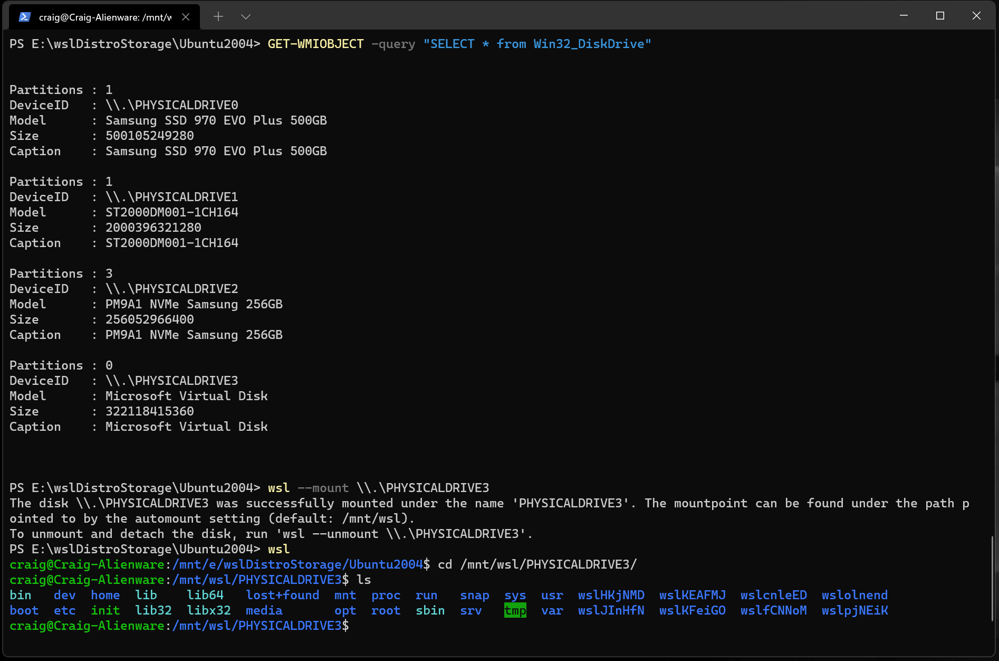

# 设置适用于 Linux 的 Windows 子系统的开发环境

这是设置“适用于 Linux 的 Windows 子系统”（Windows Subsystem for Linux，以下简称 WSL）开发环境的一个简单示例，你将了解到如何安装并使用 Ubuntu 的默认 Bash shell，也可以学习如何设置安装其他 Linux 发行版，使用基本 WSL 命令，设置 Visual Studio Code 或 Visual Studio、Git、Windows 凭据管理器，运行 MongoDB、Postgres、MySQL 等数据库，设置 GPU 加速，运行 GUI 应用程序等。

## 开始使用

适用于 Linux 的 Windows 子系统（Windows Subsystem for Linux）是由 Windows 操作系统自带的，但您必须先启用这项功能并安装 Linux 发行版，才能开始使用它。

若要使用简化的 `--install` 命令，您必须运行最新版本的 Windows 11（内部版本 20262 及以上）。若要检查版本和内部版本号，请按下 **Windows 徽标键 + R**，键入 **winver**，然后选择 **确定**。您可以使用 [设置- Windows 更新](ms-settings:windowsupdate) 或 [Windows 安装助手](https://www.microsoft.com/software-download/) 进行更新。

如果您想安装 Ubuntu 以外的 Linux 发行版，或者希望手动完成这些步骤，请参阅 [安装 WSL](../install.md) 页面了解更多详情。

打开 PowerShell (或 Windows 命令提示符) 并输入：

```powershell
wsl --install
```

`--install` 命令将执行以下操作：

- 启用可选的 适用于 Linux 的 Windows 子系统 和 虚拟机平台 组件
- 下载并安装最新的 Linux 内核
- 将 WSL 2 设置为默认版本
- 下载并安装 Ubuntu Linux 发行版（可能需要重新启动）

在此安装过程中，您需要重新启动计算机。


如果您遇到了一些问题，请查阅 [安装疑难解答](../troubleshooting.md) 。

## 设置您的 Linux 用户名和密码

在 WSL 上安装完 Linux 发行版后，请在“开始”菜单打开它（默认为 Ubuntu）。系统将要求您为此 Linux 发行版创建一个 **用户名** 和 **密码**。

- 此 **用户名** 和 **密码** 仅限于您安装的这一个 Linux 发行版，与您的 Windows 用户名无关。

- 请注意，在输入 **密码** 时，屏幕上不会显示任何内容。如果您没有看到输入的密码，这是完全正常的。

- 设置 **用户名** 和 **密码** 后，该账户将成为默认用户，并在启动此 Linux 发行版时自动登录。

- 此帐户将被视为 Linux 系统管理员，能够运行 `sudo` （Super User Do） 管理命令。

- 在 WSL 上运行的每个 Linux 发行版都有自己的 Linux 帐户和密码。 当您每次安装新发行版本、重新安装或重置时，都必须重新配置 Linux 用户帐户。

> [!NOTE]
> 随 WSL 一起安装的 Linux 发行版是按用户安装的，不能与其他 Windows 用户帐户共享。遇到用户名错误？[StackExchange： Linux 上用户的名称要求有哪些？](https://serverfault.com/questions/73084/what-characters-should-i-use-or-not-use-in-usernames-on-linux)


要更改或重置密码，请打开 Linux 发行版并输入命令：`passwd`。系统将要求您输入旧密码，然后请您输入新密码，并二次确认您的新密码。

倘若您忘记了 Linux 发行版的密码，请尝试以下步骤：

1. 打开 PowerShell，然后使用命令 `wsl -u root` 进入默认 WSL 发行版的根目录；

   > 如果您需要在非默认发行版上更新忘记的密码，请使用命令：`wsl -d Debian -u root`，将 `Debian` 替换为目标发行版的名称。

2. 您可以使用以下命令更新您的密码：`passwd <username>`，其中`<username>` 是您忘记密码的帐户的用户名；

3. 系统将提示您输入新的密码，然后确认该密码。当告知您密码已成功更新后，请使用 `exit` 命令退出 PowerShell 中的 WSL。
   
## 更新包管理器和升级软件包


建议您使用自带的软件包管理器定期更新和升级软件包。对于 Ubuntu 或 Debian，请使用以下命令：

```bash
sudo apt update && sudo apt upgrade
```

Windows 不会自动更新或升级您的 Linux 发行版，大多数 Linux 用户更喜欢自己控制它们。

## 添加更多 Linux 发行版
要添加其他 Linux 发行版，您可以通过 [Microsoft Store](https://aka.ms/wslstore)、[--import 命令](../use-custom-distro.md) 或 [旁加载您的自定义分发版](../build-custom-distro.md)。您可能还希望 [设置自定义 WSL 映像以在整个企业公司中分发](../enterprise.md)。

## 配置 Windows 终端


Windows 终端可以使用命令行界面运行任何应用程序。它的主要功能包括多选项卡、窗格、Unicode 和 UTF-8 字符支持、GPU 加速文本渲染引擎以及创建自定义主题并自定义文本、颜色、背景和快捷方式。

每当安装新的 WSL Linux 发行版时，都会在 Windows 终端中为其创建一个新实例，您可以根据个人喜好来配置它。


我们建议将 WSL 与 Windows 终端配合使用，尤其是在您想要使用多个命令行时。请参阅 Windows 终端文档，获取有关设置和自定义首选项的帮助，例如：

- 从 Microsoft Store [安装 Windows 终端或 Windows 终端（预览版）](/windows/terminal/get-started)；
- [使用命令面板](/windows/terminal/get-started#invoke-the-command-palette)；
- 设置[自定义操作](/windows/terminal/#custom-actions)，例如键盘快捷键；
- 更改默认[启动设置](/windows/terminal/customize-settings/startup)；
- 自定义外观: [主题](/windows/terminal/customize-settings/appearance#theme)，[配色方案](/windows/terminal/customize-settings/color-schemes)，[常规配置文件](/windows/terminal/customize-settings/profile-general)，[背景图片](/windows/terminal/customize-settings/profile-appearance#background-image)等；
- 了解如何使用[命令行参数](/windows/terminal/command-line-arguments?tabs=windows)，例如使用窗格或选项卡的命令行打开终端；
- 了解如何使用[搜索功能](/windows/terminal/search)；
- 查阅[提示和技巧](/windows/terminal/tips-and-tricks), 例如如何重命名或设置选项卡颜色，使用鼠标交互，启动 “Quake 模式”；
- 查阅有关[自定义命令提示符](/windows/terminal/tutorials/custom-prompt-setup), [SSH 配置文件](/windows/terminal/tutorials/ssh)或[选项卡标题](/windows/terminal/tutorials/tab-title)的教程；
- 查找[自定义终端库](/windows/terminal/custom-terminal-gallery/custom-schemes)和[故障排查指南](/windows/terminal/troubleshooting)；


## 文件存储

- 若要在 Windows 文件资源管理器中打开 WSL 项目，请输入：`explorer.exe .`    
  *请确保在命令的末尾添加句点以打开当前目录。*

- [将项目文件与计划使用的工具存储在相同的操作系统上](../filesystems.md#file-storage-and-performance-across-file-systems)。 <br />将文件存储在 WSL 文件系统中，并使用 Linux 工具在 Linux 命令行（例如 Ubuntu、OpenSUSE 等）中处理这些文件将会获得更高的性能。如果要使用 Windows 工具在 Windows 命令行（PowerShell、命令提示符）中工作，请将文件存储在 Windows 文件系统中。当然您也可以跨操作系统访问文件，但这可能会显著降低性能。

例如在存储 WSL 项目文件时：

- 使用 Linux 文件系统根目录: `\\wsl$\<DistroName>\home\<UserName>\Project`
- 不要使用 Windows 文件系统根目录: `C:\Users\<UserName>\Project` 或 `/mnt/c/Users/<UserName>/Project$`


## 设置您最喜欢的代码编辑器

我们建议使用 Visual Studio Code 或 Visual Studio，因为它们支持直接使用 WSL 进行远程开发和调试。 Visual Studio Code 使你能够将 WSL 用作功能完备的开发环境， Visual Studio 提供了对 C++ 跨平台开发的本机 WSL 支持。

### 使用 Visual Studio Code

按照此分步指南[开始将 Visual Studio Code 与 WSL 配合使用](../tutorials/wsl-vscode.md), 并安装[远程开发扩展包](https://marketplace.visualstudio.com/items?itemName=ms-vscode-remote.vscode-remote-extensionpack)。使用此扩展，能够运行 WSL、SSH 或开发容器，以使用 Visual Studio Code 功能进行编辑和调试。您可以在不同的独立开发环境之间快速切换并进行更新，而无需担心会影响本地计算机。

安装并设置完 Visual Studio Code 后，可以通过输入以下内容使用 Visual Studio Code 远程服务器直接打开 WSL 项目： `code .`

*请确保在命令的末尾添加句点以打开当前目录。*


### 使用 Visual Studio

查阅[开始将 Visual Studio 与 WSL 一起用于 C++ 跨平台开发](/cpp/build/walkthrough-build-debug-wsl2)指南。Visual Studio 2022 使你能够将 Visual Studio 的同一实例在不同的 Windows、WSL 或 SSH 连接上生成和调试 CMake 项目。


## 使用 Git 设置版本管理

查阅[开始在 WSL 上使用 Git](../tutorials/wsl-git.md)指南，将项目连接到 Git 版本控制系统，同时使用凭据管理器进行身份验证，并使用 Git Ignore 文件，了解 Git 行尾，以及使用内置到 VS Code 的 Git 命令。


## 使用 Docker 设置远程开发容器
查阅[开始使用 WSL 2 上的 Docker 远程容器](../tutorials/wsl-containers.md)指南，使用 Docker Desktop for Windows 将项目连接到远程开发容器。


## 设置数据库

查阅[开始使用 WSL 上的数据库](../tutorials/wsl-database.md)指南，将您的项目连接到 WSL 环境中的数据库。开始使用 MySQL、PostgreSQL、MongoDB、Redis、Microsoft SQL Server 或 SQLite。


## 设置 GPU 加速以提高性能
<!-- We should probably update this to be not just for "machine learning training", yes? -->
查阅[在 WSL 中设置 GPU 加速的机器学习训练](../tutorials/gpu-compute.md)指南，利用计算机的 GPU（图形处理单元）来加速繁重的工作负载。


## 基础 WSL 命令
通过 WSL 安装的 Linux 发行版最好使用 PowerShell 或 Windows 命令提示符 (CMD) 进行管理。 有关使用 WSL 时需要熟悉的基本命令的列表，请查阅 [WSL 命令参考指南](../basic-commands.md)。

此外，许多命令在 Windows 和 Linux 之间都可以交互。例如：

- [在 Windows 命令行运行 Linux 工具](../filesystems.md#run-linux-tools-from-a-windows-command-line): 打开 PowerShell， 若想通过 Linux 命令 `ls -la` 来显示 `C:\temp>` 目录下的文件， 可以使用命令： `wsl ls -la`

- [混合 Linux 和 Windows 命令](../filesystems.md#mixing-linux-and-windows-commands): 例如, Linux 命令 `ls -la` 可以列出目录的文件, PowerShell 命令 `findstr` 可以筛选包含 “git” 的字符串的结果。因此，您可以直接使用 `wsl ls -la | findstr "git"`。您还可以通过混合使用 Windows 命令 `dir` 和 Linux 命令 `grep` ： `dir | wsl grep git` 

- [直接在 WSL 命令行运行 Windows 工具](../filesystems.md#run-windows-tools-from-linux): `<tool-name>.exe`    
    例如, 若要打开 .bashrc 文件（启动 Linux 命令行时运行的 shell 脚本），可以输入： `notepad.exe .bashrc`

- [使用 Linux Grep 工具运行 Windows ipconfig.exe 工具](../filesystems.md#run-windows-tools-from-linux): 可以使用 Bash 命令`ipconfig.exe | grep IPv4 | cut -d: -f2` 或 PowerShell 命令 `ipconfig.exe | wsl grep IPv4 | wsl cut -d: -f2`   
    此示例演示了 Windows 上的 ipconfig 工具，该工具可以显示当前 TCP/IP 网络配置值，通过 Linux 工具 grep 筛选，最后将仅显示 IPv4 结果。

## 挂载外部驱动器或 USB

查阅指南[开始在 WSL 2 中装载 Linux 磁盘](../wsl2-mount-disk.md)。



## 运行 Linux GUI 应用

请查阅[运行 WSL 上的 Linux GUI 应用](../tutorials/gui-apps.md)。

## 更多资源

- [在 Windows 上设置开发环境](/windows/dev-environment/): 了解有关为您的首选语言或框架（如 React、Python、NodeJS、Vue 等）设置开发环境的详细信息；
- [疑难解答](../troubleshooting.md): 查找常见问题、报告错误、请求新功能，参与文档编撰工作的相关信息；
- [FAQs](../faq.yml): 常见问题解答；
- [发行说明](../release-notes.md): 查看 WSL 发行说明，寻找历史版本更新。你还可以查找 [WSL Linux 内核的发行说明](../kernel-release-notes.md)。
